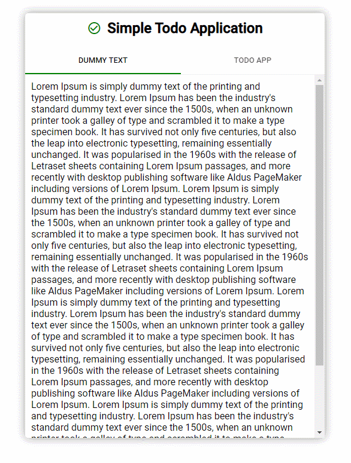

# Simple React todo application with material-ui

## 핵심 구현 내용

- Tutorial 의 대명사인 To-do application 을 React로 간단하게 구현.
- React 에서 Material UI 를 간편하게 구현할 수 있도록 해주는 `Material-UI` CSS 라이브러리 

## 실행방법
1. 이 레포지토리를 로컬 컴퓨터에 clone 한다.
2. 프로젝트 디렉토리에서 `npm install` 명령을 실행한다.
3. 프로젝트 루트에서 `npm start` 명령을 실행한다.
